# Sociality

[](https://github.com/Yusuf-98/social-media-app-by-yusuf/actions/workflows/ci.yml)

A full-stack-consuming social media app built with Next.js — feed, posts, comments,
likes, saves, follows, and profiles, backed by a REST API.

**Live demo:** [social-media-app-by-yusuf.vercel.app](https://social-media-app-by-yusuf.vercel.app/)

<p align="center">
  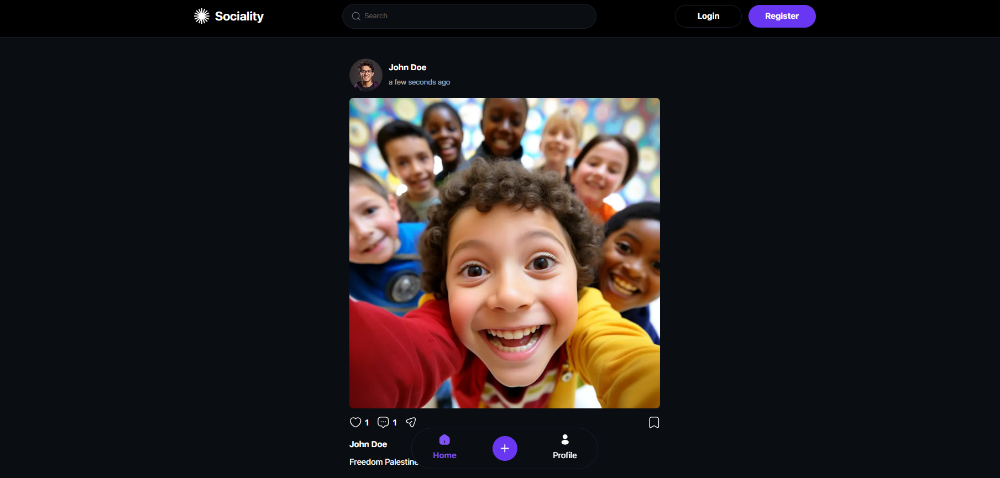
</p>


## Features

- Email/password auth (register, login, logout) with a global session guard that clears
  state and redirects to login on an expired/invalid token
- Feed (authenticated) and Explore (public) post streams with infinite scroll
- Post detail — opened as a modal over the feed or as its own page when shared directly
  — with comments, like, save, share, and owner-only delete
- Create post with image upload, also available as a modal or its own page
- Public and private profile pages, with dedicated `Posts`, `Saved`, and `Likes` routes
  on your own profile, plus a `Settings` panel for account info and logout
- Followers/following lists, follow/unfollow
- User search
- Optimistic updates (with rollback) for like, save, follow, and comment actions

## Screenshots

| | |
| --- | --- |
| 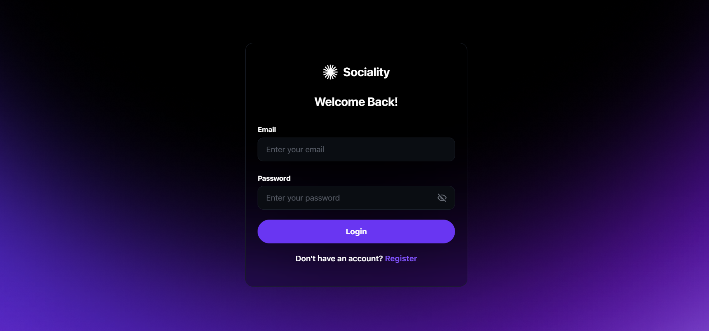 | 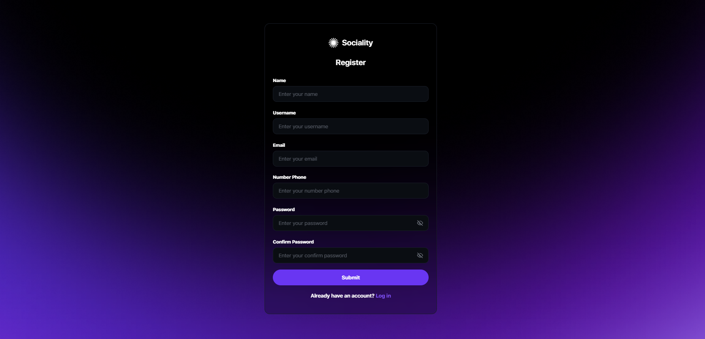 |
| **Login** — email/password sign-in | **Register** — create an account |
| 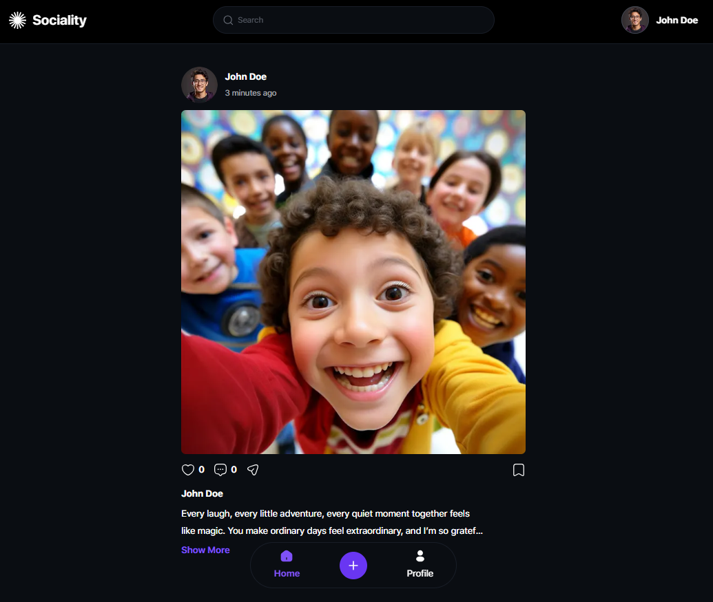 | 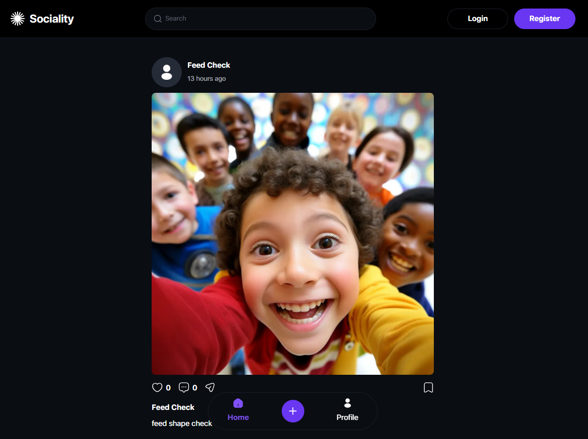 |
| **Feed** — posts from people you follow, with likes and comments | **Explore** — public feed for signed-out visitors |
| 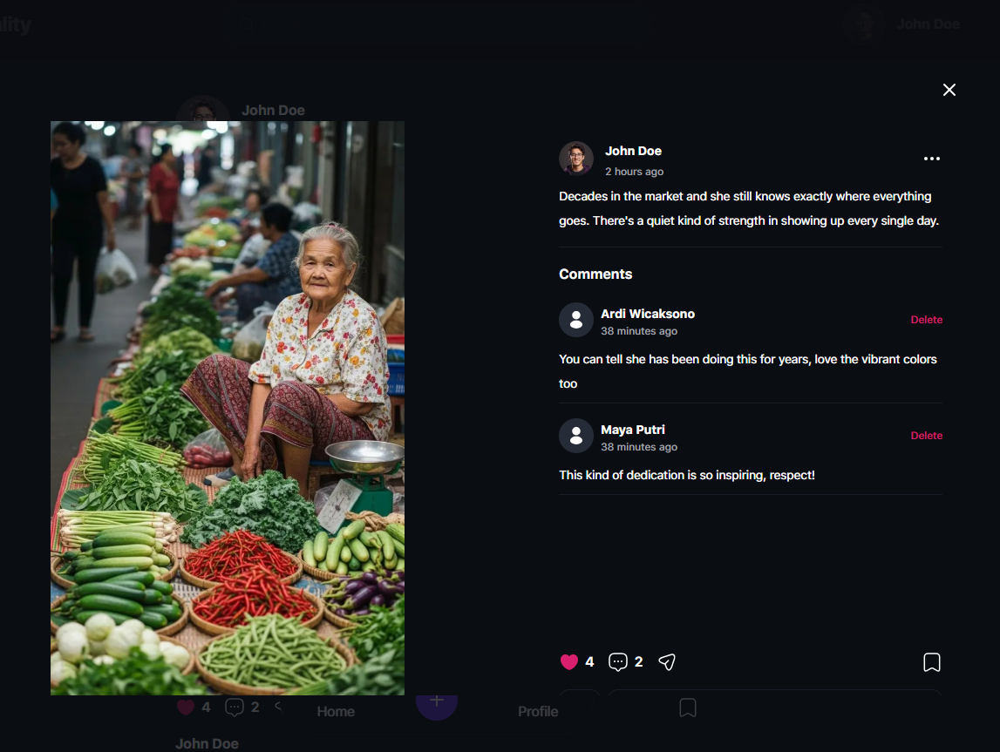 | 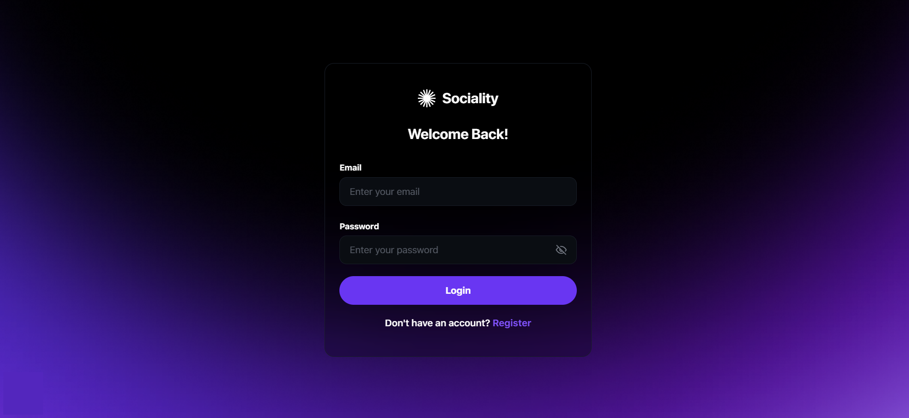 |
| **Post detail** — opens as a modal over the feed | **Post detail** — empty state before the first comment |
| 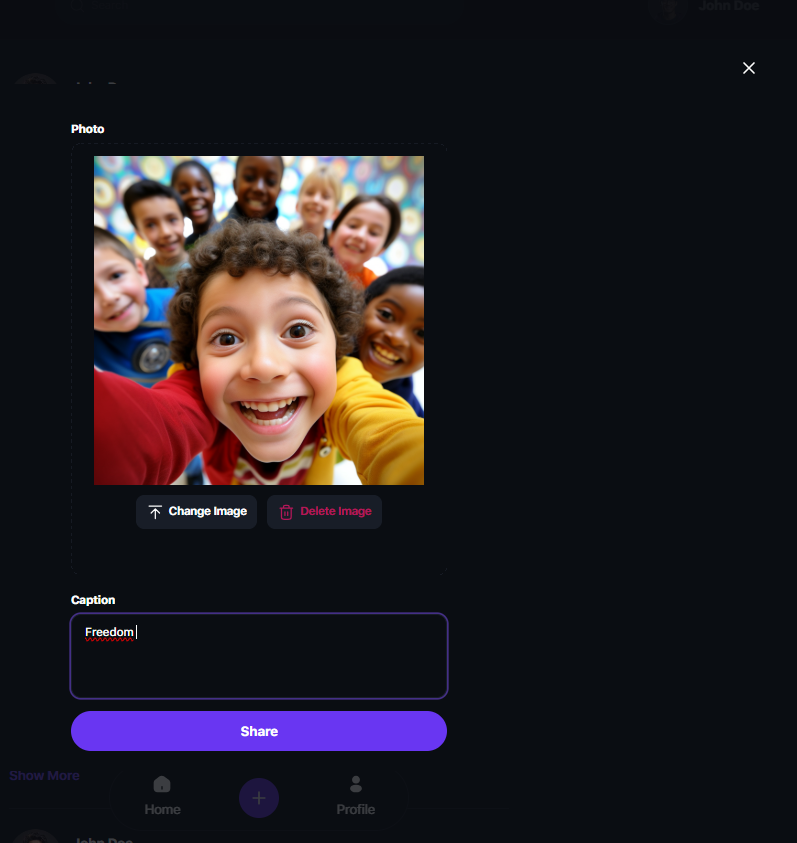 | 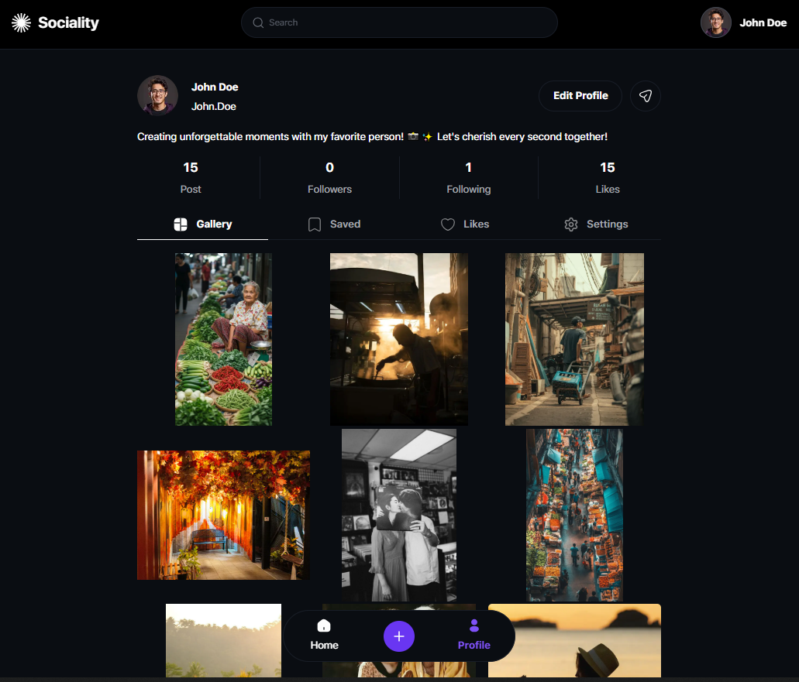 |
| **Create post** — image upload, also opens as a modal | **My profile** — gallery grid with stats |
| 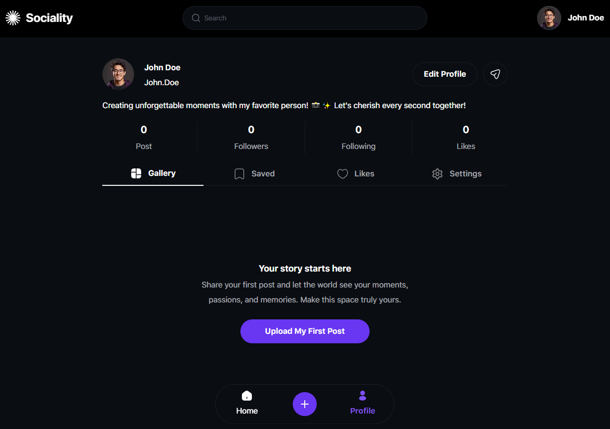 | 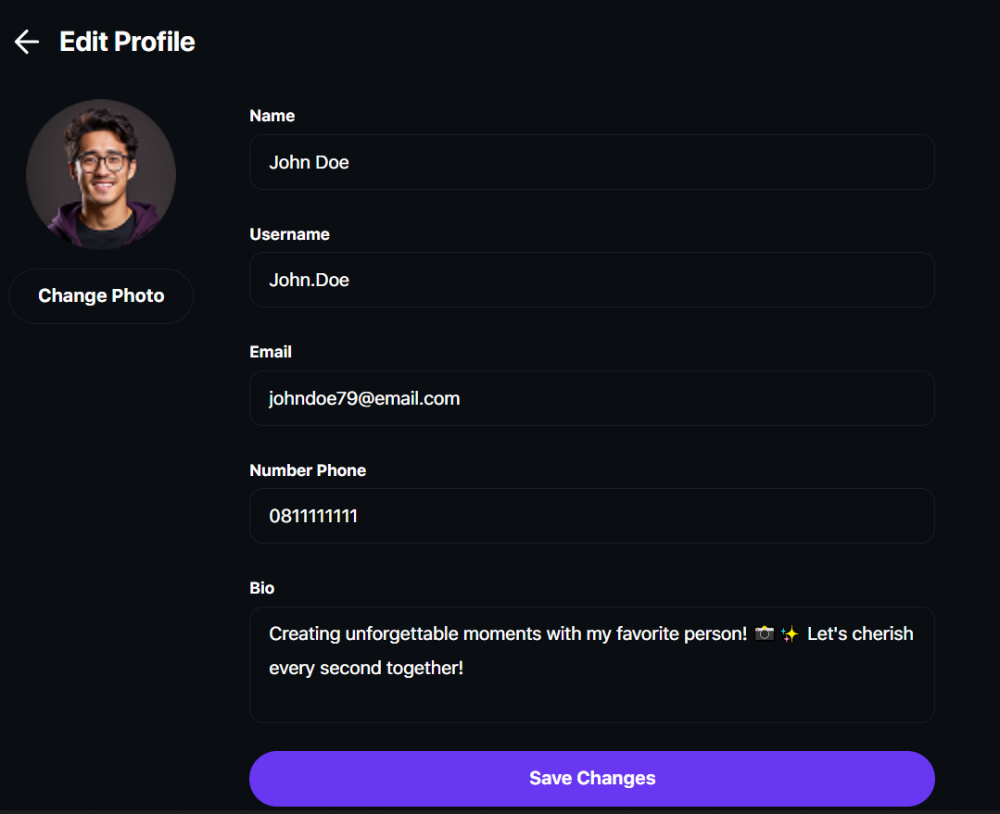 |
| **Empty profile** — first-post call to action | **Edit profile** |
| 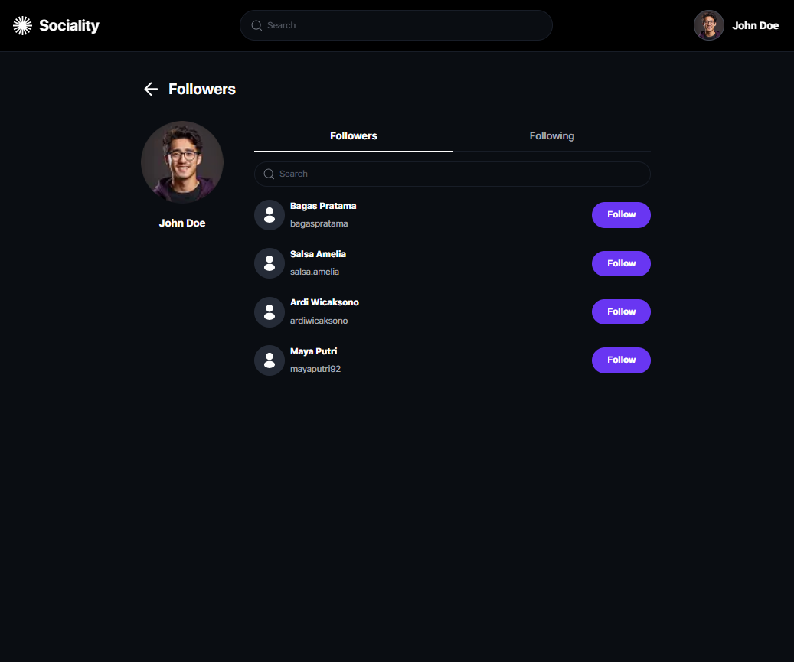 | 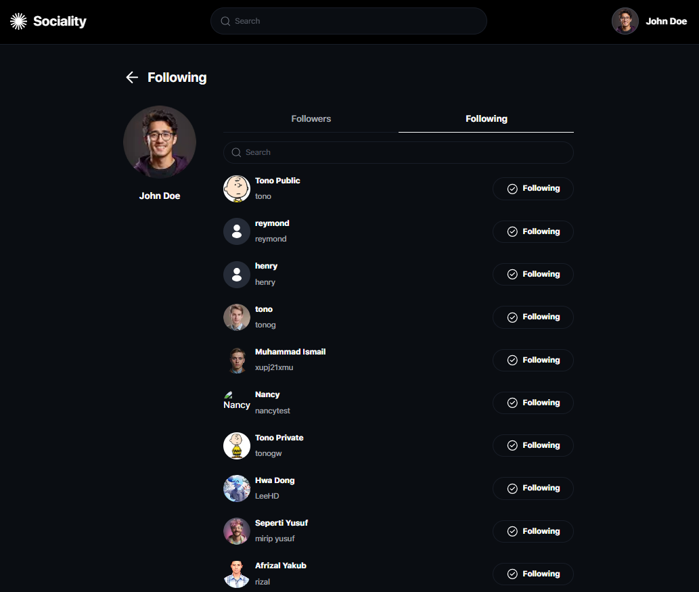 |
| **Followers** | **Following** |

<p align="center">
  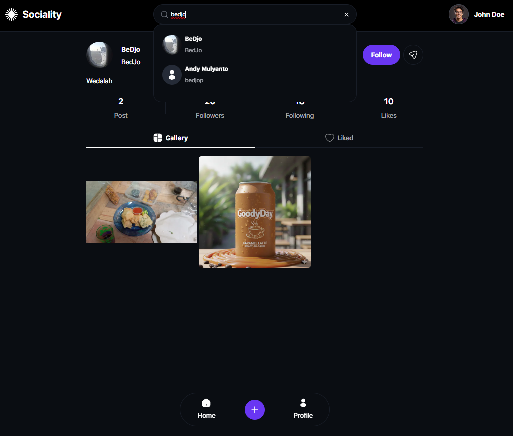
</p>

<p align="center"><b>Search</b> — debounced user search</p>

## Tech stack

- [Next.js](https://nextjs.org) (App Router) + TypeScript
- [Tailwind CSS](https://tailwindcss.com) + [shadcn/ui](https://ui.shadcn.com)
- [TanStack Query](https://tanstack.com/query) for server state (feed, posts, comments,
  likes, saves, follows)
- [Redux Toolkit](https://redux-toolkit.js.org) for auth/session state only
- [React Hook Form](https://react-hook-form.com) + [Zod](https://zod.dev) for form
  validation
- [Vitest](https://vitest.dev) + [Testing Library](https://testing-library.com) for
  unit/integration tests

## Getting started

1. Install dependencies:

   ```bash
   npm install
   ```

2. Configure environment variables — copy `.env.example` to `.env.local` and fill it in:

   ```bash
   cp .env.example .env.local
   ```

3. Run the dev server:

   ```bash
   npm run dev
   ```

   Open [http://localhost:3000](http://localhost:3000).

| Command | Description |
| --- | --- |
| `npm run dev` | Start the dev server |
| `npm run build` | Production build |
| `npm run start` | Run the production build |
| `npm run lint` | Lint the codebase |
| `npm run test` | Run the test suite |
| `npm run format` | Format with Prettier |
| `npm run format:check` | Check formatting without writing |

## Testing

Tests live next to the code they cover (`*.test.ts(x)`) and run with Vitest and Testing
Library. They target real interactive logic rather than static markup:

- **Cache patching**: `patchEntityInCache`/`patchPost` across flat, list-wrapped, and
  `InfiniteData` cache shapes.
- **Pagination**: `flattenPages` dedupes items that appear on more than one page by id.
- **Like/save cross-check**: cached liked/saved id lists correctly override a post's own
  `likedByMe`/`savedByMe` flags.
- **Optimistic mutations**: `useLikeToggle` (optimistic update, rollback on error, like
  count never goes negative) and `useComments` (optimistic insert/remove, `commentCount`
  bump/decrement, rollback on error).
- **Auth**: the API client's global 401 handler (only fires when a request actually
  carried a token) and `auth-storage`'s token helpers keeping localStorage, the cookie,
  and Redux in sync.

GitHub Actions runs lint, typecheck, tests, and a production build on every push and
pull request to `main` (see [ci.yml](.github/workflows/ci.yml)).

## Performance

- Post and avatar images are served from Cloudinary and optimized by `next/image`
  (automatic AVIF/WebP, responsive `sizes`) rather than shipped at source resolution.
- The first/priority image in the feed and grid loads eagerly; everything else is lazy.
- Post images render at their own aspect ratio instead of being cropped, avoiding a
  fixed-box reflow once the real image loads.
- Pages that don't need client interactivity for their initial render are Server
  Components, keeping their JS out of the client bundle.
- TanStack Query caches server state with a 30s stale time, and infinite scroll loads
  posts/comments/lists a page at a time instead of all at once.

## API

The app talks to a separate REST API. It has no published OpenAPI/Swagger document, so
the contract this frontend relies on is summarized here.

- **Envelope**: every response is `{ success, message, data }`. The API client
  (`src/lib/api/client.ts`) unwraps `data` and turns `success: false` into an
  `ApiError` carrying the HTTP status.
- **Auth**: `POST /api/auth/login` and `POST /api/auth/register` return `{ token, user }`.
  The token is sent as `Authorization: Bearer <token>`. A `401` on an authenticated
  request clears the session and redirects to login.
- **Pagination**: list endpoints take `page` and `limit` query params.

| Area | Endpoints used |
| --- | --- |
| Auth | `POST /api/auth/register`, `POST /api/auth/login` |
| Feed | `GET /api/feed`, `GET /api/posts` (explore) |
| Posts | `POST /api/posts`, `GET /api/posts/:id`, `DELETE /api/posts/:id` |
| Likes | `POST`/`DELETE /api/posts/:id/like`, `GET /api/posts/:id/likes`, `GET /api/me/likes` |
| Comments | `GET`/`POST /api/posts/:id/comments`, `DELETE /api/comments/:id` |
| Follow | `POST`/`DELETE /api/follow/:username`, `GET /api/me/followers`, `GET /api/me/following` |
| Saves | `POST`/`DELETE /api/posts/:id/save`, `GET /api/me/saved` |
| Profile | `GET`/`PATCH /api/me`, `GET /api/users/:username`, `GET /api/users/search` |

## Project structure

```
src/
├── app/            # Routes (App Router) — Server Components by default,
│                   # interactive pieces delegated to client components
├── components/     # UI components, grouped by feature (post, profile, comment, ...)
├── hooks/          # TanStack Query hooks, grouped by feature
├── lib/
│   ├── api/        # API client + one file per resource
│   └── ...         # Cache patching, query keys, pagination, utils
├── store/          # Redux slice (auth token + hydration flag only)
├── types/          # Shared API types
└── proxy.ts        # Server-side route guard (Next's middleware convention)
```

## Deployment

Deployed on [Vercel](https://vercel.com), auto-deploying `main`. `NEXT_PUBLIC_API_BASE_URL`
is configured as a project environment variable there.

## Author

Built by [Yusuf AR](https://github.com/Yusuf-98).

## License

Licensed under the [MIT License](LICENSE).
